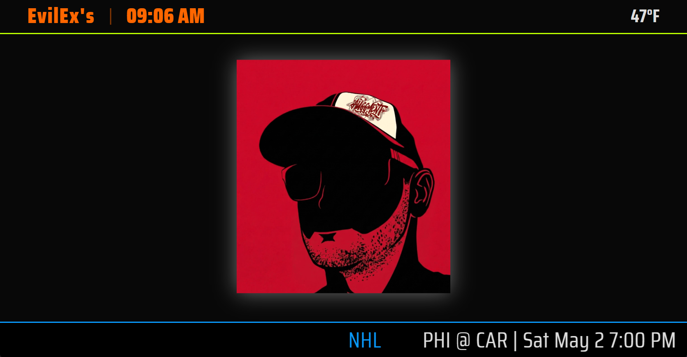
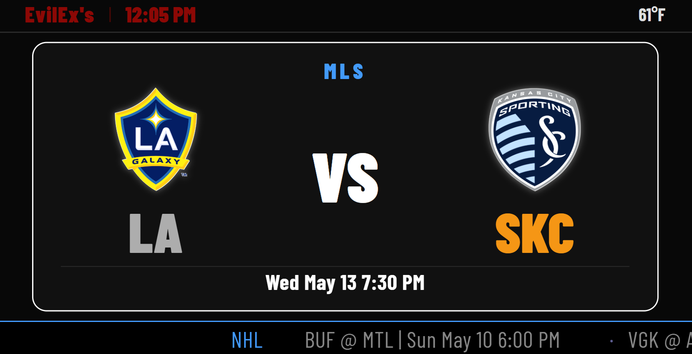
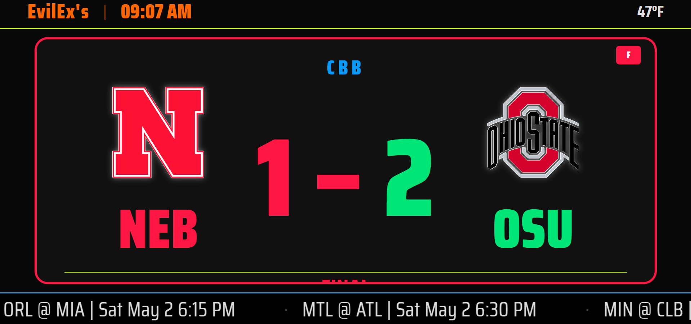
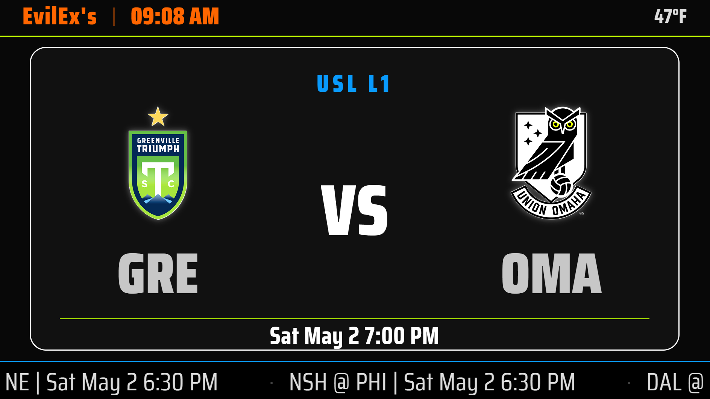
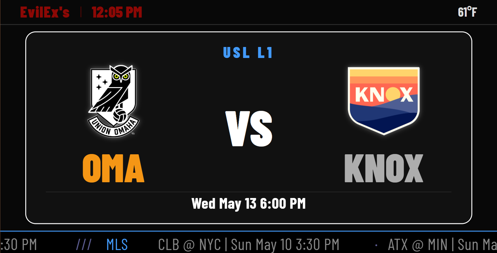

# Auggmented Scoreboard



## What This Is

Auggmented Scoreboard turns any spare TV into a live, always-on sports ticker for the games you actually care about. Point it at a TV in the kitchen, the garage, the man cave, a break room, a sports bar, a gym, or a church fellowship hall — anywhere people glance up wanting to know the score right now instead of waiting for it.

The problem it solves: national broadcasts and generic score tickers cycle through dozens of games you don't care about before they ever get to yours, and they almost never carry your local high school, college, or rec-league team at all. This app skips all of that. You tell it which leagues and which specific teams matter to you — your NFL team, your kid's high school football team, your alma mater's basketball team, your local NASCAR driver — and it shows *those* scores, live, on a loop, with no waiting and no noise from games or markets that don't mean anything to you.

It pulls real-time scores from ESPN for the major pro and college leagues, plus dedicated leaderboard views for racing (NASCAR, IndyCar, F1) and golf (PGA), and it can also pull in local school schedules directly from your school's athletics page (Thrillshare, MaxPreps, RSS, or iCal calendars) — so the same screen showing the Chiefs score can also show "Auburn HS Football @ Home — Friday 7:00 PM."

## What It Does

* **Live Scores & Tickers** — Real-time scores for NFL, MLB, NBA, WNBA, NHL, MLS, NWSL, top European soccer leagues, college football/basketball/baseball/softball/volleyball, MiLB, USL, lacrosse (PLL/NLL), and more.
* **Racing & Golf** — Dedicated leaderboard cards for NASCAR, IndyCar, F1, and PGA, with your favorite drivers/golfers highlighted even when they're outside the top 10.
* **Local Sports Integration** — Automatically parses your school's or league's calendar (Thrillshare, MaxPreps, RSS, or iCal) to show upcoming local games right alongside the pro and college scores.
* **Kiosk/Server Architecture** — Run one central Server that pulls all the data, and pair as many Kiosk displays (TVs) to it as you want. Each kiosk shares the same live data but can have its own name, colors, orientation, and theme.
* **Fully Customizable Look** — Pick a dark or light theme, a display font, and a color for nearly every element on screen (scores, team names, ticker, racing leaderboards, card backgrounds) from the Settings page — no code required.
* **Smart Automation** — Scheduled display on/off times, automatic Wi-Fi management, and self-updating from GitHub releases or a local update package.

## Requirements

* **Operating System**
  * Raspberry Pi: Raspberry Pi OS (Lite is recommended for Server; Desktop for Kiosk/Combined).
  * Generic PC: Debian or Ubuntu-based Linux distributions.
* **Hardware**: Raspberry Pi 3/4/5 or any x86_64 PC, plus a TV or monitor for Kiosk/Combined mode.
* **Environment**: The installer targets a non-graphical (CLI) fresh OS install. For Kiosk/Combined mode it installs and configures its own minimal window manager (Openbox) and display server (X11) — you don't need a desktop environment pre-installed.

## Installation

**1. Prepare the OS**

Start with a fresh install of Raspberry Pi OS or Ubuntu/Debian.

**2. Download Files**

Place `app.py`, `install.sh`, `version.txt`, `requirements.txt`, and the `templates/` and `static/` folders together in a directory (e.g. `/home/pi/scoreboard`).

**3. Run the Installer**

```bash
chmod +x install.sh
sudo ./install.sh
```

**4. Choose Your Mode**

- **Server** — No display, headless data backend other kiosks point to.
- **Kiosk** — Display-only client that points to a server (or runs standalone).
- **Combined** — Server and display together on one machine — the simplest single-TV setup.

## Accessing the Settings Page

Once installed, find the device's IP address (`hostname -I` on the Pi, or check your router's connected-devices list), then open a browser to:

| Mode               | Default Port | Settings URL                          |
|---------------------|:---:|----------------------------------------|
| Server              | `5000` | `http://<device-ip>:5000/settings`  |
| Combined            | `5000` | `http://<device-ip>:5000/settings`  |
| Kiosk               | `5001` | `http://<device-ip>:5001/settings`  |

**Default login is `admin` / `atsi`** — change this immediately from the Settings page (Admin Credentials section) once you're in.

If you can't find the device's IP (e.g. no DHCP, no router access), `install.sh` automatically assigns a fallback static IP of **`192.168.1.250`** on the wired Ethernet port as a failsafe — connect a laptop to the same switch/router and browse to `http://192.168.1.250:5000/settings` (or `:5001` for kiosk-only installs).

## Google Chrome Troubleshooting (x86_64)

On PC-based Linux (x86_64), the script prefers Google Chrome for kiosk stability, while Raspberry Pi (ARM) always uses Chromium.

**If Chrome fails to install:**

**Manual Download** — If the installer can't find the `.deb` file, download it yourself:

```bash
wget https://dl.google.com/linux/direct/google-chrome-stable_current_amd64.deb
```

**Placement** — Put the `.deb` file in the same folder as `install.sh` before running it.

**Dependency Fix** — If you see "broken packages," run:

```bash
sudo apt --fix-broken install
```

**Fallback** — If Chrome still isn't found, `install.sh` automatically falls back to `chromium-browser`.

## How It Works & Tips

### Pairing Kiosks

On the Server's Settings page, generate a one-time "Pairing Code" (valid for 10 minutes). Enter the Server's URL and that code on the Kiosk's Settings page to securely link it to the Server's data feed.

### Local Schedules

Go to Settings → Local Schedule and paste the URL of your school's or league's athletics page (or a MaxPreps link). The app automatically detects the feed type (Thrillshare, MaxPreps, iCal, or RSS) and pulls in upcoming games.

### Display Control

The app uses `xset` to control the TV over DPMS/HDMI-CEC for the scheduled "Power On/Off" feature, and `unclutter` to keep the mouse cursor hidden on kiosk displays.

## Troubleshooting

* **Black Screen on Boot** — Check `systemctl status kiosk.service`. Make sure graphics drivers are installed if it can't open the display.
* **Unstyled / Broken-Looking Page** — Confirm `static/css/main.css` exists under the install directory; re-run `install.sh` if it's missing.
* **Data Not Updating** — Check backend logs with `journalctl -u scoreboard -f` and verify the machine has internet access to reach ESPN's APIs.
* **Sudo Errors** — The app needs specific `NOPASSWD` entries in `/etc/sudoers.d/scoreboard` to control the display and services from the web UI. These are created automatically by the installer.

## Screenshots

| | |
|---|---|
|  |  |
|  |  |
|  |  |
